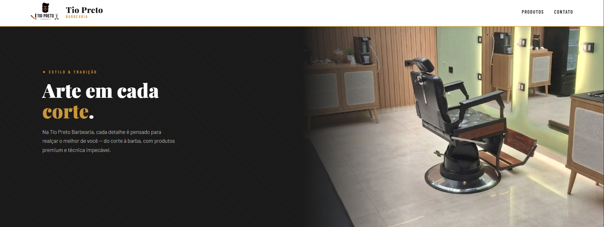

# Tio Preto Barbearia

### website institucional para uma barbearia

 

---

## sobre

este projeto foi desenvolvido como uma prática de aprendizado utilizando apenas HTML e CSS.

o website foi criado para apresentar a barbearia, exibindo:
- produtos
- informações do estabelecimento
- formas de contato
- elementos visuais estilizados

---

## objetivo

o principal objetivo deste projeto foi praticar:
- estruturação de páginas web
- estilização com CSS
- organização de conteúdo
- construção de layouts simples
- desenvolvimento de projetos reais para aprendizado

---

## tecnologias utilizadas

| tecnologia | finalidade |
|---|---|
| HTML | estrutura do website |
| CSS | estilização e layout |

---

## preview

---

### "aprendizado através da prática."

